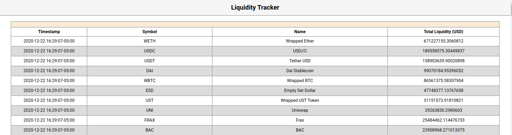
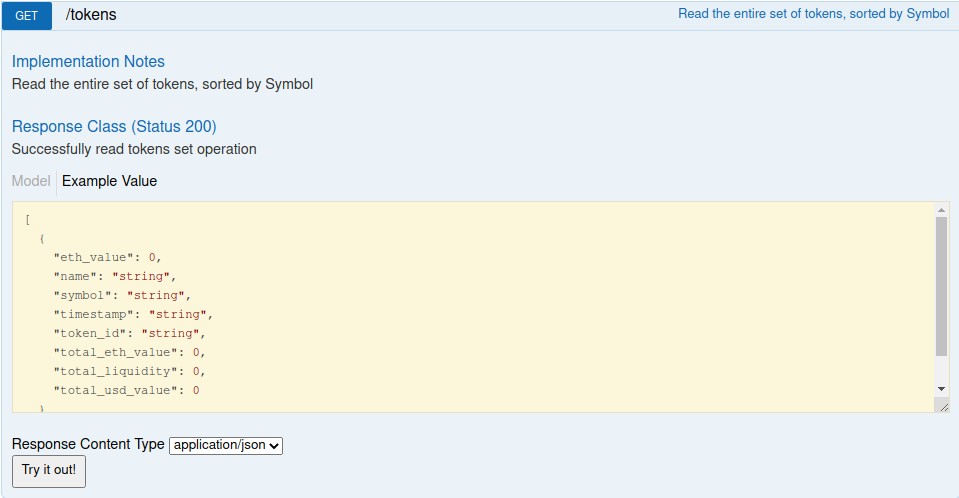
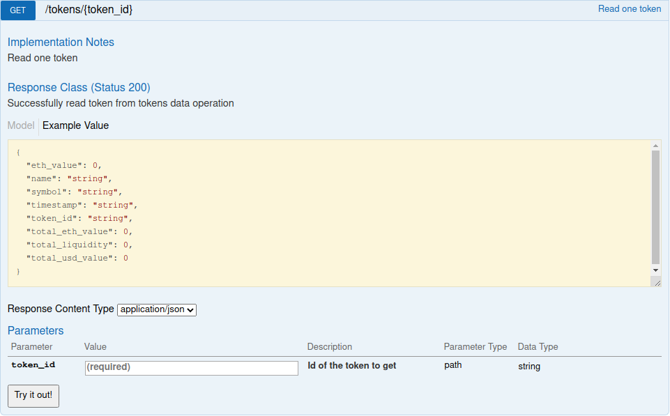
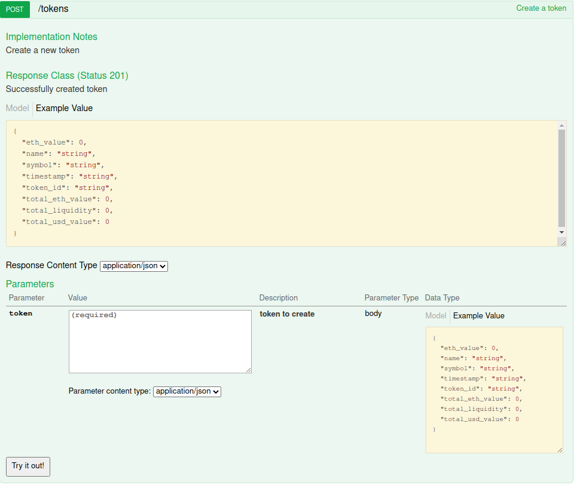
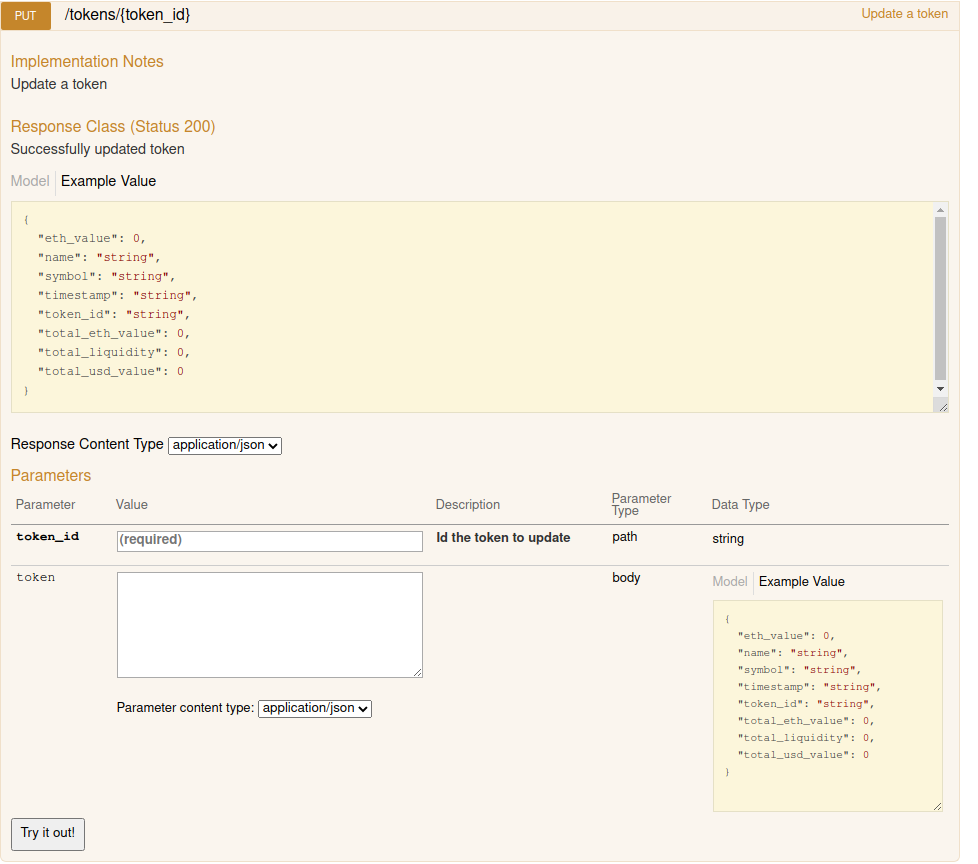
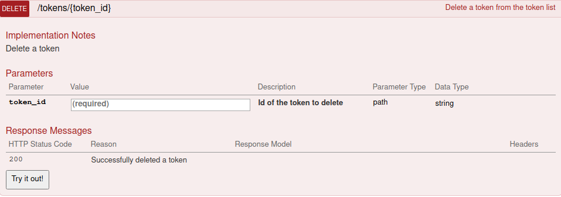
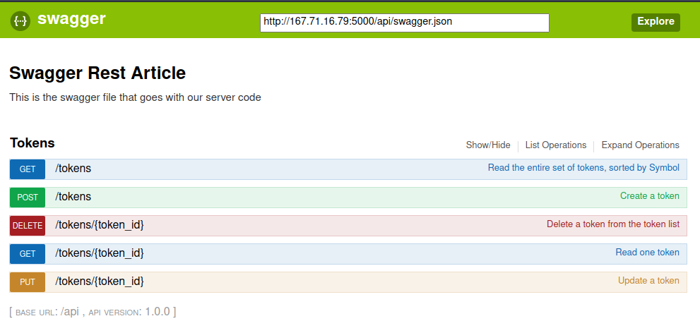

# AMM Liquidity Tracker

[](https://travis-ci.com/faisal233/amm-liquidity-tracker.svg?branch=main)
[](https://codecov.io/gh/faisal233/amm-liquidity-tracker)
[](https://amm-liquidity-tracker.readthedocs.io/en/latest/?badge=latest)

AMM Liquidity Tracker is a python REST API that tracks total liquidity of ERC20 tokens available on automated market makers.

## Technology Used
* [Flask](https://github.com/pallets/flask)
* [Connexion/Open API](https://github.com/zalando/connexion)
* [Swagger](https://github.com/swagger-api)
* [SQLAlchemy](https://github.com/sqlalchemy)

## Installation 

Clone the repository
```bash
git clone https://github.com/faisal233/amm-liquidity-tracker.git
```

Use the package manager [pip](https://pip.pypa.io/en/stable/) to install dependencies
```bash
pip3 install -r requirements.txt
```

Start the server
```bash
python3 liquidity-tracker/server.py
```

## Usage
Server.py runs on port 5000, creates a database of ERC20 token liquidity available on automated market makers and updates the database every 300 seconds. 

### Example Frontend
A simple frontend displaying liquidity for all tokens can be accessed from http://localhost:5000


### API Open Endpoints
* Read the entire set of tokens: `GET /api/tokens`


* Read one token: `GET /api/tokens/{token_id}`


* Create a token: `POST /api/tokens`


* Update a token: `PUT /api/tokens/{token_id}`


* Delete a token `DELETE /api/tokens/{token_id}`


### Swagger UI
The swagger UI can be accessed from http://localhost:5000/api/ui/


## Demo
* Frontend: http://167.71.16.79:5000/
* Swagger UI: http://167.71.16.79:5000/api/ui/
* GET tokens: http://167.71.16.79:5000/api/tokens
* GET token: http://167.71.16.79:5000/api/tokens/0xc02aaa39b223fe8d0a0e5c4f27ead9083c756cc2

## Docs:
[Read The Docs](https://amm-liquidity-tracker.readthedocs.io/en/latest/)

## Contributing
Pull requests are welcome. For major changes, please open an issue first to discuss what you would like to change.

Please make sure to update tests as appropriate.

## Personal Page
https://faisal233.github.io/

## License
[MIT](https://choosealicense.com/licenses/mit/)

